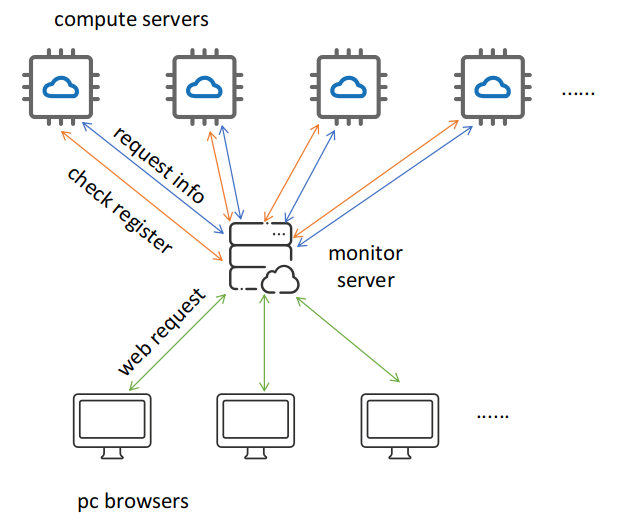

# Compute Servers Status Monitor

sers-monitor means Compute Servers Status Monitor.

It is a tool to monitor the compute servers status. The tool consists of two parts: cserver and mserver. 

"cserver" means compute server, it runs on the compute servers. "mserver" means monitor server, it runs on the monitor server.

## Principle of the tool

The principle of the monitor tool can described in the following diagram.

First, the compute server(s) check if it is registered in the monitor server; 

Then, the monitor server request the registered compute server's status.

In fact the "first" and "then" step are executing **Periodically and Independently**. 

It means that: The monitor server just request information of the registered compute server(s); And the compute server(s) Periodically check if it is asked for status information, if there is no request for "a long" time, send a register request to the monitor server.

The monitor server also server as a web service. It responds to the browser's request and send the computer servers' status to the browser.

## I need you

The compute server monitor tool is quit simple now, especially the web view. 

It means: there is still a lot of room for improvement. 

So I need your help. I will really appreciate it if you want to improve the tool (web view or status information). Here is the [Development details](development.md).

## Todo List

### [Improve]

#### Web view
- 是否有一个简单干净的页面（表格形式）？显示最主要信息（GPU显存利用率，CPU利用率，CPU内存利用率），每台机器的详细信息以链接形式打开。 （周余）

#### Message

### [Feature]
1. 服务器预约功能：实现当GPU不空闲时，可以通过网页进行预约，一旦GPU空闲，自动执行预约的任务。

